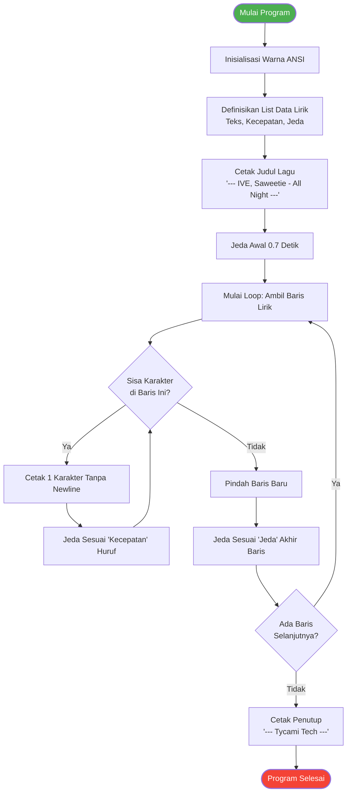

# All Night - IVE ft. Saweetie (Lyrics Animation)

Project ini adalah sebuah script Python sederhana yang menampilkan lirik lagu **"All Night"** oleh IVE dan Saweetie di terminal dengan efek mengetik (typing effect) yang tersinkronisasi. Warna teks yang digunakan adalah ungu, memberikan estetika yang cantik pada tampilan terminal.

## 🚀 Fitur
- **Typing Effect**: Lirik ditampilkan karakter demi karakter, mensimulasikan efek orang sedang mengetik.
- **Custom Timing**: Kecepatan pengetikan huruf dan jeda waktu antar baris disesuaikan (custom delay) untuk setiap potongan lirik.
- **Terminal Colors**: Menggunakan ANSI escape code untuk memberikan warna ungu (magenta) pada teks output.
- **Graceful Exit**: Penanganan interupsi (seperti menekan `Ctrl+C`) agar program bisa berhenti dengan rapi tanpa menampilkan error traceback yang mengganggu.

## 📋 Prasyarat
Untuk menjalankan program ini, pastikan Anda telah menginstal:
- [Python 3.x](https://www.python.org/downloads/) (Tidak ada library eksternal yang dibutuhkan).

## ⚙️ Cara Menjalankan

1. Buka terminal (atau Command Prompt / PowerShell).
2. Arahkan direktori (menggunakan `cd`) ke folder tempat file ini disimpan.
3. Jalankan perintah berikut:
   ```bash
   python Lyrics.py
   ```
4. Nikmati animasi liriknya!

## 📊 Alur Program (Mermaid)

Berikut ini adalah visualisasi alur kerja logika dari script `Lyrics.py`:



## 👨‍💻 Penulis
Code di dalam script ditandai dengan label penutup **Tycami Tech**.
